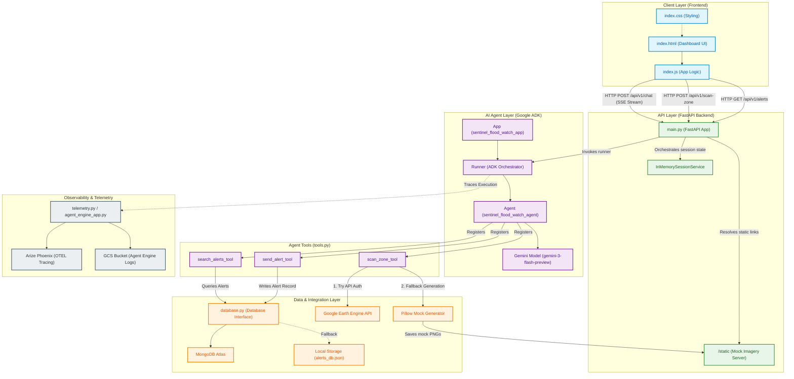

# Sentinel Flood-Watch: System Architecture

This document describes the system architecture, component interactions, data flows, dependencies, and fallback mechanisms for the **Sentinel Flood-Watch** application.

---

## 1. System Architecture Diagram

---

## 2. Layer Definitions

### A. Client Layer (Frontend)
The user interface is built as a lightweight, interactive web dashboard:
* **`index.html`**: Structure of the monitoring map, chat panel, control settings, and alerts table.
* **`index.css`**: Premium dark-mode styling with harmonic green/accent borders, smooth hover animations, and card layouts.
* **`index.js`**: Core client-side execution, handling:
  * Fetching historical alerts via `/api/v1/alerts`.
  * Initiating direct scans of Accra coordinates via `/api/v1/scan-zone`.
  * Initiating conversational interactions via `/api/v1/chat` and parsing the server-sent events (SSE) stream to display real-time thinking, tool execution logs, and Gemini responses.

### B. API Layer (FastAPI Backend)
A fast, asynchronous HTTP server built with FastAPI that exposes REST and streaming endpoints:
* **`/api/v1/alerts`**: Serves logs of historical alerts retrieved from the database layer.
* **`/api/v1/scan-zone`**: Bypasses the LLM agent to immediately run the satellite scan tool for specific coordinates.
* **`/api/v1/chat`**: The primary conversational interface. It wraps Google ADK's `Runner` inside an SSE stream generator, broadcasting real-time agent updates (reasoning, tool calls, tool responses, final reply) to the client.
* **`/static`**: Serves baseline and current Sentinel-2 simulation images generated by the scanning pipelines.

### C. AI Agent Layer (Google ADK & Gemini)
The agentic intelligence layer orchestrating tools to monitor Accra's waterways:
* **`Agent`**: The `sentinel_flood_watch_agent` configured with detailed system instructions. It defines coordinates for sites of interest (Korle Lagoon, Odaw River, Sakumono Ramsar, Densu Delta) and runs a multi-step diagnostic workflow when prompted.
* **`Model`**: Leverages `Gemini (gemini-3-flash-preview)` as the reasoning engine.
* **`App`**: Wraps the agent to expose operations and orchestrate configurations.
* **`Runner`**: Executes agent sessions using `InMemorySessionService` to manage and store conversation history.

### D. Agent Tools (`tools.py`)
Custom Python functions decorated/structured to interface directly with the Gemini model:
* **`scan_zone_tool`**: Receives coordinates, attempts Google Earth Engine connection, computes vegetation (NDVI) and water (MNDWI) indices, and returns URLs for baseline and current images.
* **`send_alert_tool`**: Commits verified encroachment instances to the database (saving details such as severity, site name, coordinate location, evidence link, and agent summary) and triggers NADMO/AMA alerts.
* **`search_alerts_tool`**: Searches database logs for matching keywords to retrieve past incident details.

### E. Data & Integration Layer
Handles all persistent storage and external integration:
* **Database Driver (`database.py`)**: Asynchronous interface wrapping MongoDB Atlas. 
* **Database Fallback (`alerts_db.json`)**: If MongoDB Atlas environment credentials are unset or the connection times out, the backend automatically switches to a local file database (`alerts_db.json`) to guarantee 100% hackathon portability.
* **Satellite Pipeline Fallback (Pillow)**: If Google Earth Engine authentication is missing, the system gracefully falls back to generating highly realistic, coordinate-patterned satellite images (showing green vegetation, water channels, and grey/red residential concrete encroachment) using the Pillow library.

### F. Observability & Telemetry
Integrates enterprise-grade logging and monitoring for AI agents:
* **Arize Phoenix**: Automatic OpenTelemetry-based tracing of Gemini model calls and custom ADK tool executions.
* **GCP Cloud Logging & GCS Logging**: Ingests agent telemetry, tool metrics, and feedback records, exporting them to standard Google Cloud Storage buckets for post-evaluation audits.
